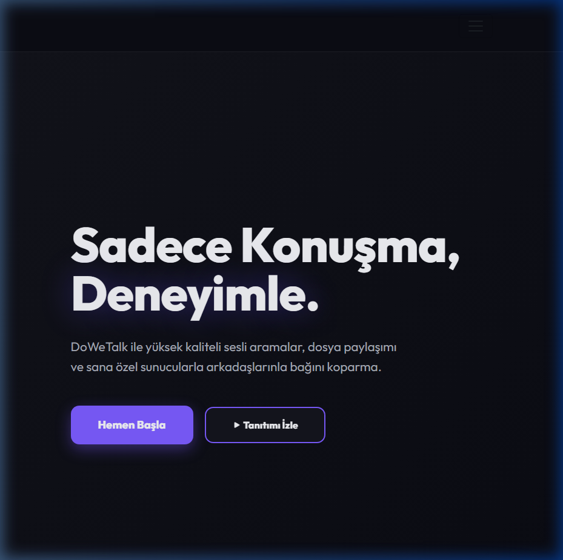
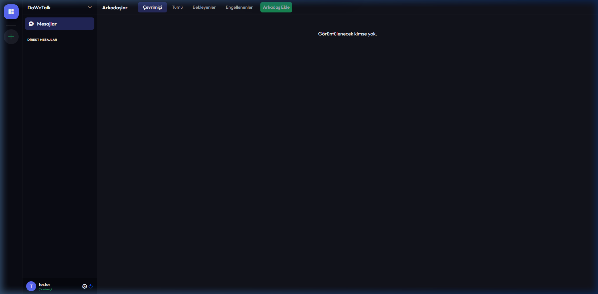
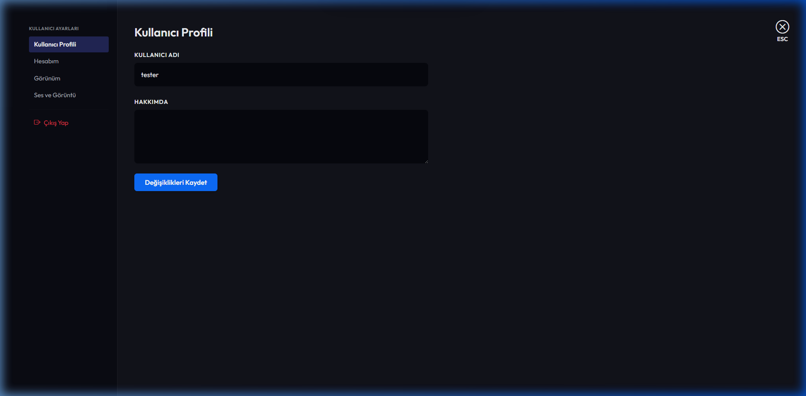

# DoWeTalk 🚀

[](https://dotnet.microsoft.com/download)
[](https://dotnet.microsoft.com/apps/aspnet/signalr)
[](https://opensource.org/licenses/MIT)

**DoWeTalk**, modern iletişim ihtiyaçları için geliştirilmiş, Discord tarzı bir topluluk ve sesli sohbet platformudur. Gerçek zamanlı mesajlaşma, yüksek kaliteli sesli odalar ve ekran paylaşımı gibi özelliklerle donatılmış, premium tasarımlı bir web uygulamasıdır.



## ✨ Özellikler

### 💬 Gerçek Zamanlı İletişim
- **Anlık Mesajlaşma:** SignalR ile güçlendirilmiş, gecikmesiz sohbet deneyimi.
- **Odalar ve Kanallar:** Sunucu bazlı hiyerarşik kanal yapısı.
- **Özel Mesajlar (DM):** Arkadaşlarınızla birebir iletişim.

### 🎙️ Sesli ve Görüntülü Deneyim
- **Sesli Odalar:** WebRTC teknolojisi ile Discord tarzı sesli kanallar.
- **Ekran Paylaşımı:** Tek tıkla yüksek çözünürlüklü ekran paylaşımı.
- **Ses Kontrolleri:** Mikrofon susturma ve kulaklık sağırlaştırma seçenekleri.

### 🛡️ Yönetim ve Güvenlik
- **Sunucu Yönetimi:** Özel sunucular oluşturma ve vanity URL desteği.
- **Rol Sistemi:** Esnek izin yapısı ve renkli roller.
- **Modern Auth:** ASP.NET Identity ile güvenli kayıt ve giriş sistemi.

### 🎨 Görsel Mükemmellik
- **Gelişmiş Tema Sistemi:** Koyu mod ve dinamik renk seçenekleri.
- **Premium UI:** Glassmorphism ve modern animasyonlarla zenginleştirilmiş arayüz.



## 🛠️ Teknoloji Yığını

- **Backend:** ASP.NET Core MVC (C#)
- **Real-time:** SignalR
- **Communication:** WebRTC (Peer-to-Peer)
- **Database:** SQL Server & Entity Framework Core
- **Frontend:** Vanilla JS, HTML5, CSS3 (Custom Design System)
- **Auth:** ASP.NET Core Identity

## 🚀 Hızlı Başlangıç

### Gereksinimler
- .NET 8.0 SDK
- SQL Server

### Kurulum

1. Depoyu klonlayın:
   ```bash
   git clone https://github.com/taklaci59/wetalkin.git
   ```

2. Veritabanı bağlantı dizesini `appsettings.json` dosyasında güncelleyin.

3. Bağımlılıkları yükleyin ve projeyi çalıştırın:
   ```bash
   dotnet restore
   dotnet run
   ```

4. Tarayıcınızda `http://localhost:5288` adresine gidin.



## 📄 Lisans
Bu proje [MIT](LICENSE) lisansı altında lisanslanmıştır.
